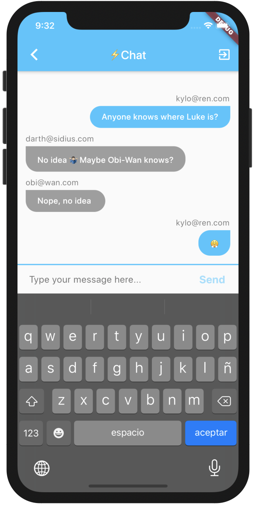

# Flash Chat ⚡️

A simple chat app developed to explore the connection of Flutter to a back-end (Firebase Auth + Firestore). Based on the [Udemy Complete 2020 Flutter Development Bootcamp with Dart](https://www.udemy.com/course/flutter-bootcamp-with-dart/).

  

## Topics explored

- Named routes and routes generation
- Streams and the StreamBuilder widget
- Firestore and Firebase Auth
- Basic animations